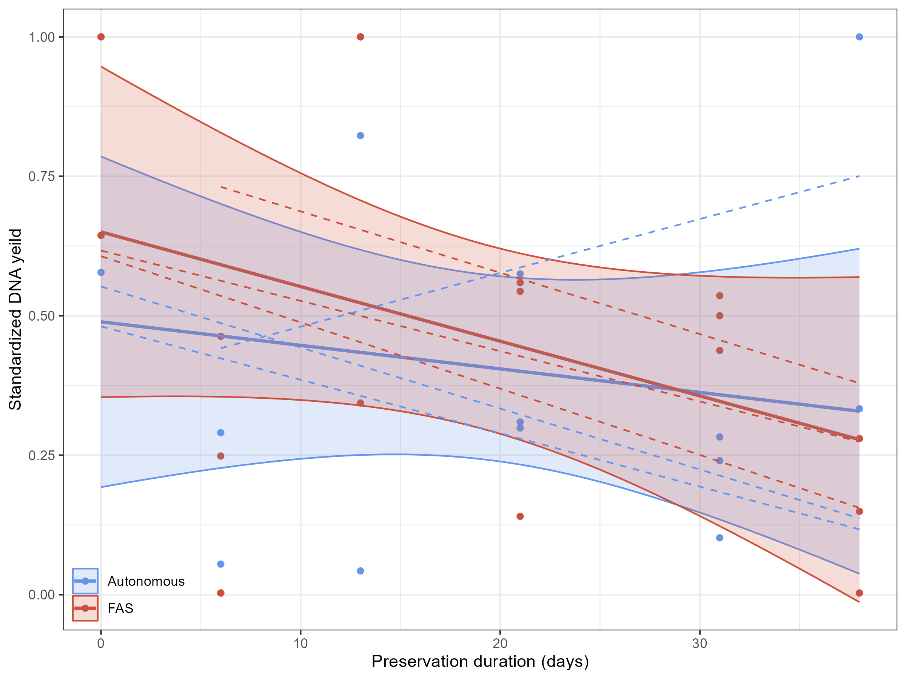
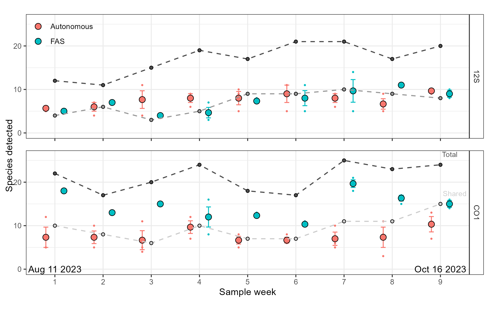
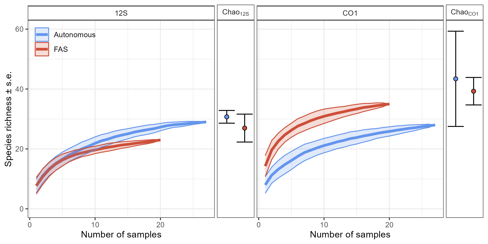
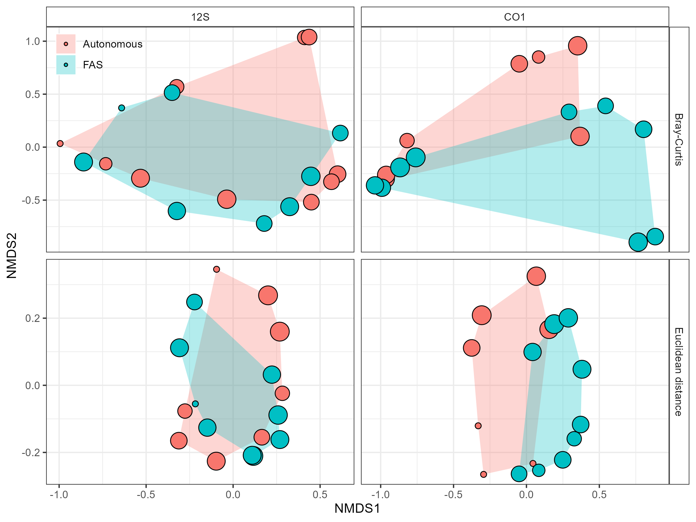

# Evaluating an Autonomous eDNA Sampler for Marine Environmental Monitoring: Short- and Long-Term Applications

Code and data for an environmental DNA (eDNA) experiment conducted in summer 2023 comparing [DOT autonomous eDNA samplers](https://dartmouthocean.com/products/edna-sampler) with a standardized protocol using Smith-Root benchtop filtering setup. 

Sample processing and sequence data is provided through a partnership with the Hakai Institute, British Columbia. Raw sequence reads are available in the [NCBI Sequence Read Archive](https://www.ncbi.nlm.nih.gov/bioproject/PRJNA1139183)

__Deployment Mosaic for the autonomous eDNA samplers in the Bedford Basin.__

***

# Figures from manuscript

__Fig 1.__ Mosaic of intake filter throughout the 9 week evaluation period. 

__Fig 2.__ Trends in DNA extraction yield over time, comparing samples preserved in RNAlater by the autonomous samplers and those preserved at -80 after filtering at the time of sample (FAS).

__Fig 3.__ Comparison of species richness by sampling method and sample time. Dashed lines represent the average number of shared species and the total number of species detected among sampling methods at each time point. Error bars indicate standard error.

__Fig 4.__ Comparison of species richness trajectories by sampling method and eDNA marker. Ribbon plots represent species accumulation curves, while points indicate the Chao extrapolated richness in the sampled species pool (± s.e.) for each sampling method over the sampling period. 

__Fig 5.__ Plot comparing compositional changes in species richness as a function of sampling period, amplification primer, and community dissimilarity metric using non-metric multidimensional scaling. Size of points corresponds to the sampling period scaling from smallest (week 1) to largest (week 9).
